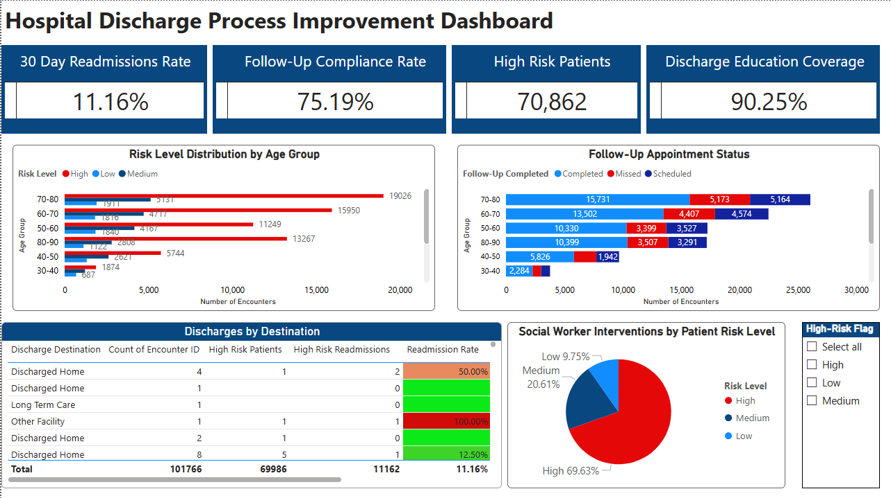
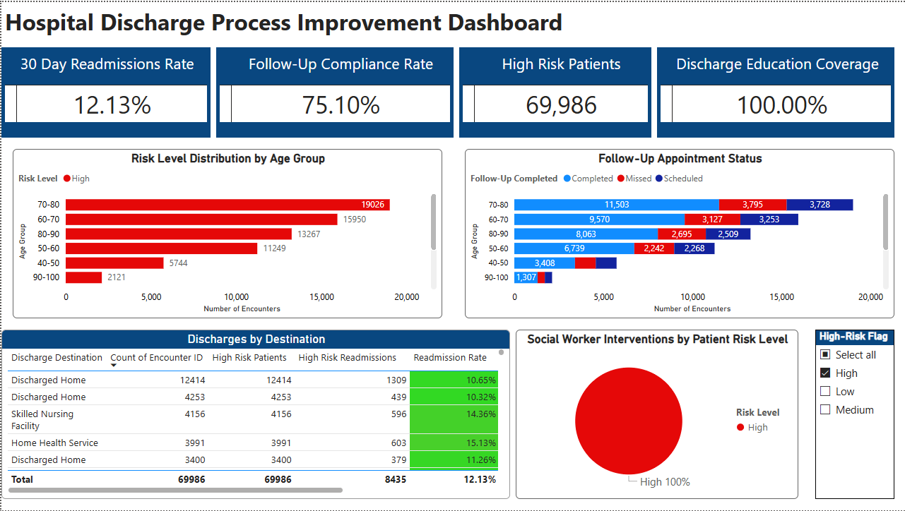
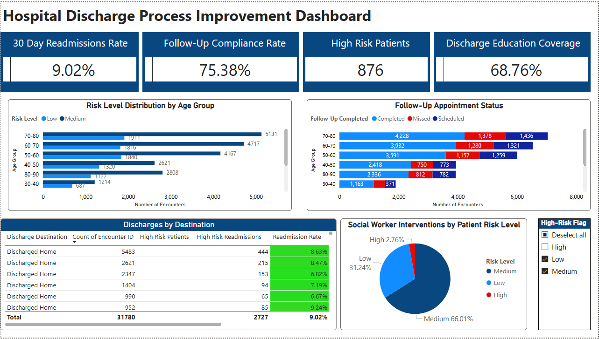
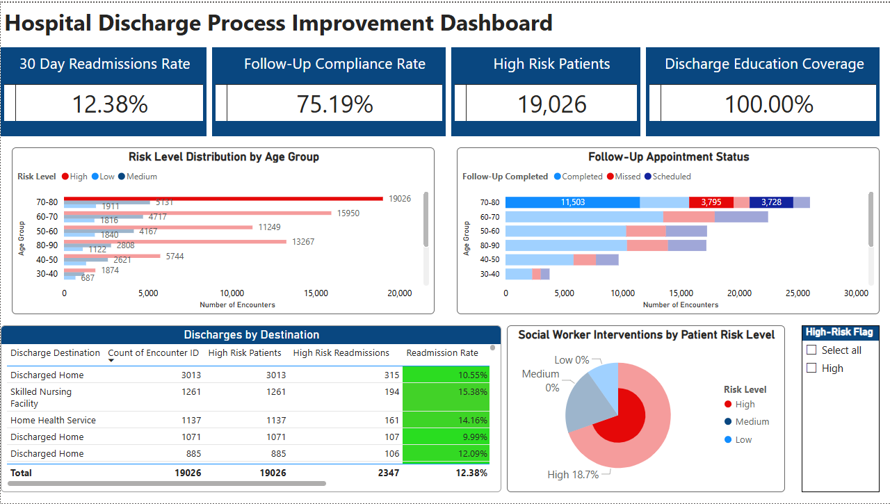
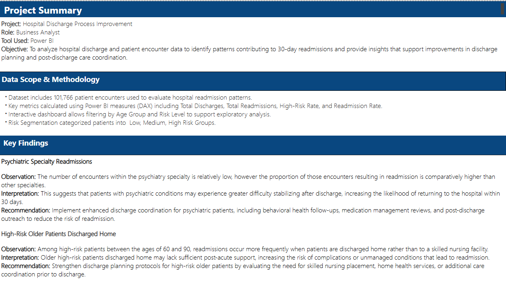

# Hospital Discharge Process Improvement

## Business Problem
Hospitals aim to reduce 30-day readmission rates to improve patient outcomes and avoid unnecessary costs. However, accurately measuring readmissions and identifying true risk factors requires reliable data and consistent definitions.

## Objective

- Analyze hospital readmission data to identify key drivers and potential process gaps
- Validate data accuracy and ensure proper classification of readmissions
- Identify opportunities to improve discharge workflows and patient outcomes
- Support data-driven decision-making through process improvement recommendations

## Data Validation & Key Insight
During analysis, it was identified that the dataset initially classified intra-hospital transfers (e.g., Emergency Department to inpatient admission) as readmissions.

After refining the definition to reflect true 30-day readmissions:

- The hospital’s readmission rate was found to be below the national benchmark
- The perceived performance issue was influenced by data classification inconsistencies

## My Role
### Business Analyst
- Conducted end-to-end process analysis
- Defined business and functional requirements
- Identified workflow inefficiencies and care gaps
- Designed improved future-state processes (TO-BE)
- Developed KPIs and success metrics
  
## Current State (AS-IS)
The existing discharge process lacked:
- Standardized discharge instructions
- Consistent follow-up scheduling
- Early identification of high-risk patients
This resulted in:
- Missed follow-ups
- Medication access issues
- Increased readmission risk
(Include your AS-IS flowchart image here)

## Key Pain Points Identified
- Inconsistent patient education
- Medication access barriers
- Lack of follow-up coordination
- Delayed identification of high-risk patients 

## Future State (TO-BE Solution)
Designed a standardized, proactive discharge process including:
- Early risk assessment during treatment
- Automatic social worker intervention for high-risk patients
- Pre-scheduled follow-up appointments
- Standardized discharge education
- Medication access coordination (delivery / support)
(Include TO-BE flowchart image here)

## Business Impact
Key Insight
- Accurate data classification is critical for measuring performance and guiding decisions
Value Delivered
- Identified and corrected a data interpretation issue
- Prevented misleading conclusions about hospital performance
- Highlighted workflow improvement opportunities despite strong baseline performance

## Functional Requirements (See BRD)
- Early risk assessment system for patients
- Automated follow-up scheduling
- Discharge checklist standardization
- Medication coordination tracking
- Outcome monitoring and reporting
  
## Stakeholders
- Physicians
- Nursing Staff
- Social Workers
- IT / Data Teams
- Quality Improvement Team
- Patients
  
## Tools Used
- Excel
- Power BI (for reporting/dashboard concept)
- Lucidchart (process mapping)
  
## Documentation
*Full Business Requirements Document (BRD):*

### Overview Page

### High-Risk Patient Encounters

### Medium and Low Risk Patient Encounters

### High-Risk Age Group Encounters

### Project Summary

